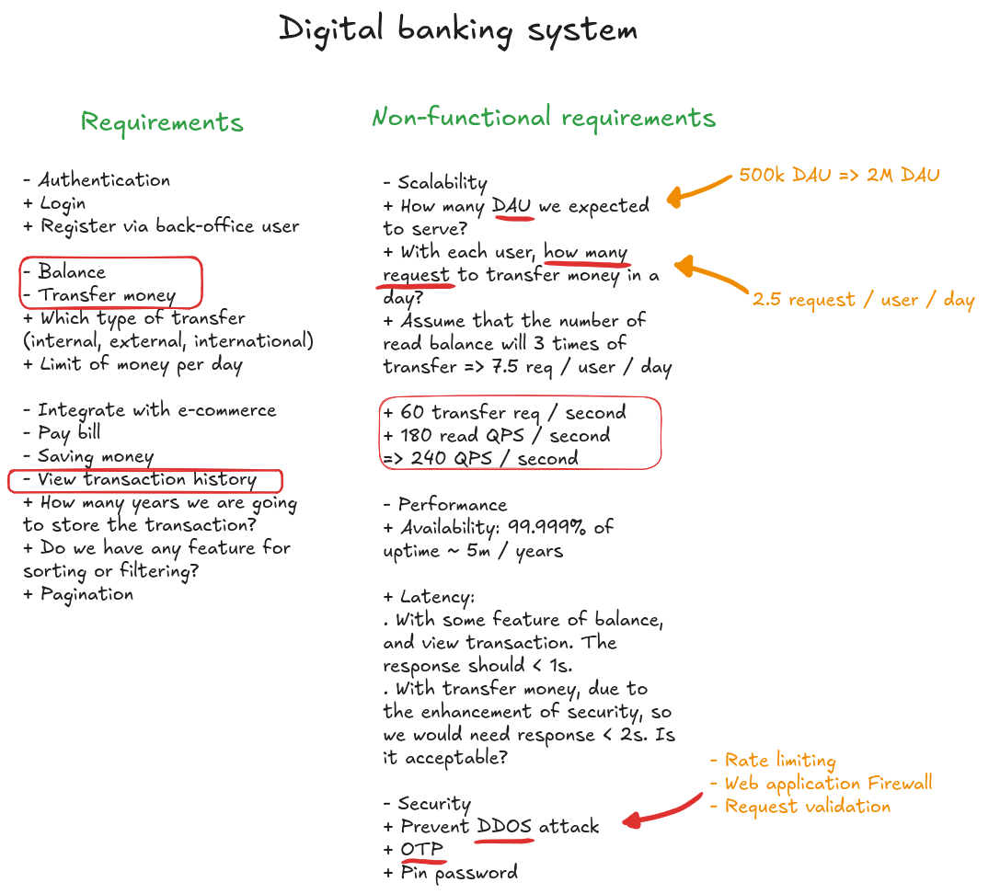

# Digital banking

## Problem statement
Design a digital banking system where users can manage their accounts, transfer money, pay bills, and view transaction history through a web or mobile app. The system should ensure high security, real-time transaction processing, and high availability.

## Solution

### Diagram

